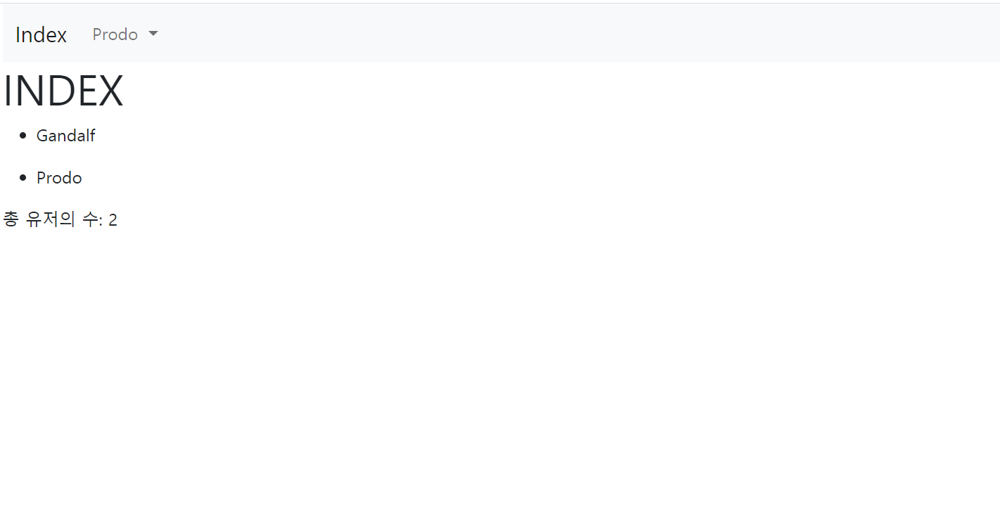
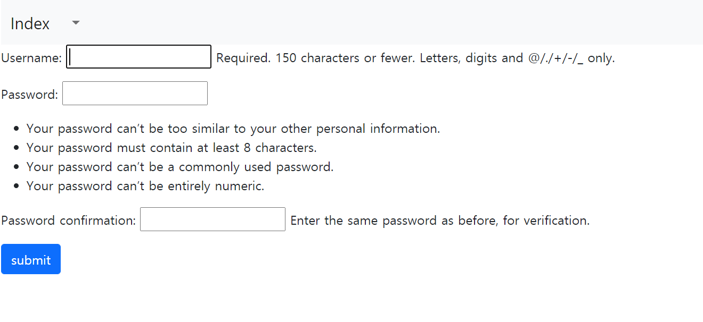
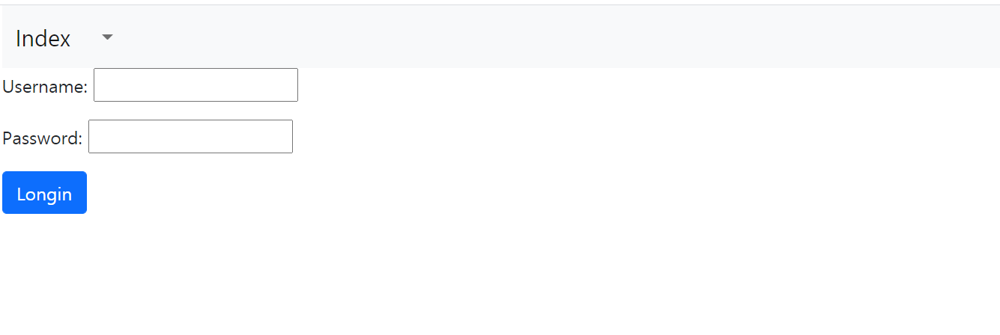

# Django Autentication System


## Signup

- 회원 가입 기능을 구현

- views.py

  ```python
  # 회원 목록 조회
  def index(request):
      users = User.objects.all()
      context = {
          'users': users
      }
      return render(request, 'accounts/index.html', context)
  
  # 회원 가입 기능
  @require_http_methods(['GET', 'POST'])
  def signup(request):
      if request.method == 'POST':
          form = CustomUserCreationForm(request.POST)
          if form.is_valid():
              user = form.save()
              auth_login(request, user)
              return redirect('accounts:index')
      else:
          form = CustomUserCreationForm()
      context = {
          'form': form
      }
      return render(request, 'accounts/form.html', context)
  ```

- 
- 


## Login

- 로그인 기능을 구현
- views.py
- 

## Logout

- 로그아웃 기능을 구현
- views.py

## Update

- 회원정보 수정 기능을 구현
- views.py

## Delete

- 회원 삭제 기능 구현
- views.py

## Change Password

- 비밀번호 수정 기능 구현
- views.py