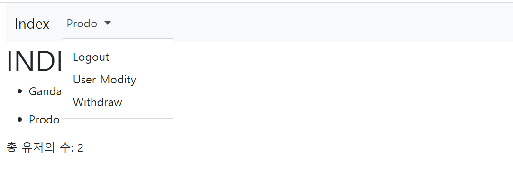
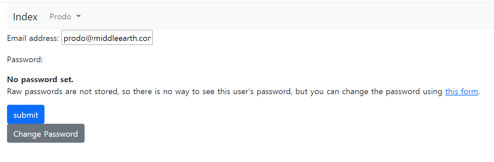
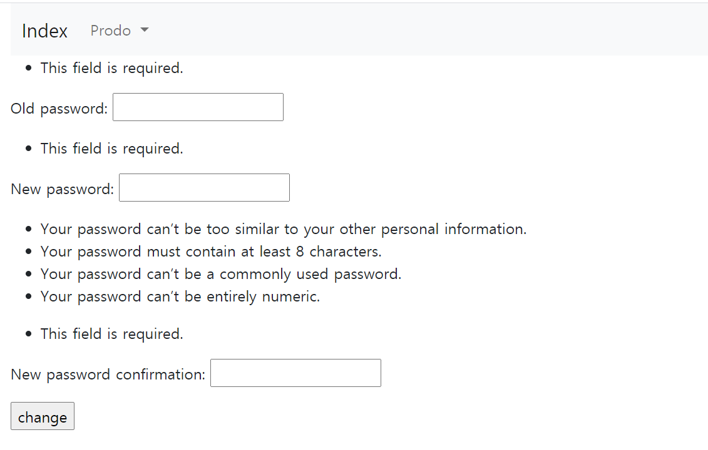

# Django Autentication System


## 1. Signup

- 회원 가입 기능을 구현

- views.py

  ```python
  # 회원 목록 조회
  def index(request):
      users = User.objects.all()
      context = {
          'users': users
      }
      return render(request, 'accounts/index.html', context)
  
  # 회원 가입 기능
  @require_http_methods(['GET', 'POST'])
  def signup(request):
      if request.method == 'POST':
          form = CustomUserCreationForm(request.POST)
          if form.is_valid():
              user = form.save()
              auth_login(request, user)
              return redirect('accounts:index')
      else:
          form = CustomUserCreationForm()
      context = {
          'form': form
      }
      return render(request, 'accounts/form.html', context)
  ```

- 어려웠던 점
  - `user = form.save()`
  - `auth_login(request, user)`
    - 함수에 인자 사용하는 것 ... 외울 것
- 
- 

## 2. Login

- 로그인 기능을 구현

- views.py

  ```python
  @require_http_methods(['GET', 'POST'])
  def login(request):
      if request.method == 'POST':
          form = AuthenticationForm(request, request.POST)
          if form.is_valid():
              auth_login(request, form.get_user())
              return redirect('accounts:index')
      else:
          form = AuthenticationForm(request)
      context = {
          'form': form
      }
      return render(request, 'accounts/login.html', context)
  ```

- `form.get_user()`

  - auth_login(): 인자 2개

- 

## 3. Logout

- 로그아웃 기능을 구현

- views.py

  ```python
  @require_POST
  def logout(request):
      if request.user.is_authenticated:
          auth_logout(request)
          return redirect('accounts:index')
  ```

  

## 4. Update

- 회원정보 수정 기능을 구현

- views.py

  ```python
  @login_required
  @require_http_methods(['GET', 'POST'])
  def update(request):
      if request.method == 'POST':
          form = CustomUserChangeForm(request.POST, instance=request.user)
          if form.is_valid():
              form.save()
              return redirect('accounts:index')
      else:
          form = CustomUserChangeForm(instance=request.user)
      context = {
          'form': form
      }
      return render(request, 'accounts/form.html', context)
  ```

- instance 잊지 말기!!!!!!
  - 원래 있는 값을 가져와야하므로
  - update임을 유념할 것
- 


## 5. Delete

- 회원 삭제 기능 구현

- views.py

  ```python
  @require_POST
  def delete(request):
      if request.user.is_authenticated:
          request.user.delete()
          # 로그아웃 시키는거 잊지말기
          auth_logout(request)
          return redirect('accounts:index')
  
  ```

  

## 6. Change Password

- 비밀번호 수정 기능 구현

- views.py

  ```python
  @require_POST
  def password(request):
      if request.method == 'POST':
          form = PasswordChangeForm(request.user, request.POST)
          if form.is_valid():
              form.save()
              # session
              update_session_auth_hash(request, form.user)
              return redirect('accounts:index')
      else:
          form = PasswordChangeForm(request.user)
      context = {
          'form': form
      }
      return render(request, 'accounts/password.html', context)
  ```

- 

